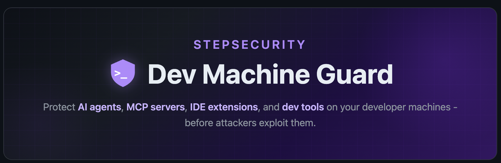
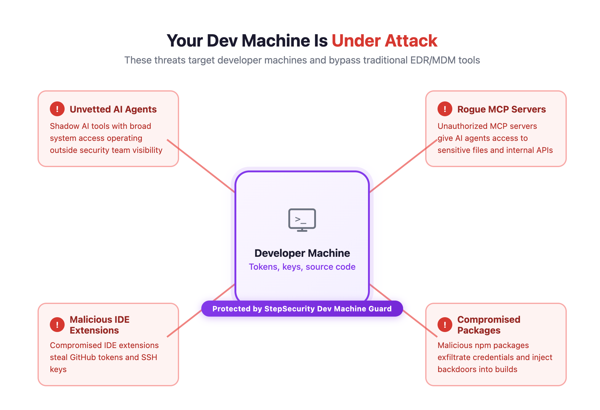
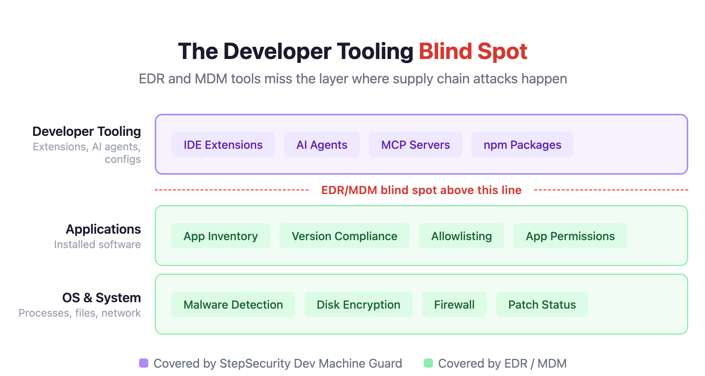

<h1 align="center">StepSecurity Dev Machine Guard</h1>

  

## Why Dev Machine Guard?

Developer machines are the new attack surface. They hold high-value assets — GitHub tokens, cloud credentials, SSH keys — and routinely execute untrusted code through dependencies and AI-powered tools. Recent supply chain attacks have shown that malicious VS Code extensions can steal credentials, rogue MCP servers can access your codebase, and compromised npm packages can exfiltrate secrets.

  

**EDR and traditional MDM solutions** monitor device posture and compliance, but they have **zero visibility** into the developer tooling layer:

| Capability                        | EDR / MDM | Dev Machine Guard |
|-----------------------------------|:---------:|:-----------------:|
| IDE extension audit               |           |        Yes        |
| AI agent & tool inventory         |           |        Yes        |
| MCP server config audit           |           |        Yes        |
| Node.js package scanning          |           |        Yes        |
| Device posture & compliance       |    Yes    |                   |
| Malware / virus detection         |    Yes    |                   |

**Dev Machine Guard is complementary to EDR/MDM — not a replacement.** Deploy it alongside your existing tools via MDM (Jamf, Kandji, Intune) or run it standalone.

  

...